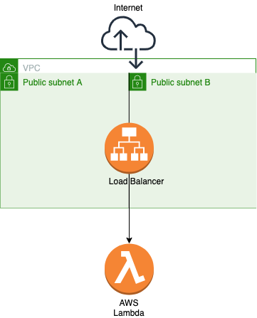

# [T3chFlicks](https://t3chflicks.org): AWS API with ALB and Lambda Quickstart
> Quickstart for running an example API on AWS with Application Load Balancer and Lambda.


---

## `tutorials/`


[](./blog_post.md)

[](https://medium.com/@t3chflicks/cheaper-than-api-gateway-alb-with-lambda-using-cloudformation-b32b126bbddc)


### Architecture
> 

### Usage
```
$ curl loadb-LoadB-R7RVQD09YC9O-1401336014.eu-west-1.elb.amazonaws.com
Hello World!
```

### Setup
1. Deploy VPC
    * `aws cloudformation create-stack --stack-name vpc --template-body file://aws/vpc.yml --capabilities CAPABILITY_NAMED_IAM`
    * tutorial for VPC can be found [here](https://medium.com/@t3chflicks/virtual-private-cloud-on-aws-quickstart-with-cloudformation-4583109b2433)
1. Deploy Service
    * `aws cloudformation create-stack --stack-name service --template-body file://aws/service.yml --capabilities CAPABILITY_NAMED_IAM`
1. Deploy Service with CORS enabled
    * `aws cloudformation update-stack --stack-name service --template-body file://aws/service_CORS.yml --capabilities CAPABILITY_NAMED_IAM`

---

This project was created by [T3chFlicks](https://t3chflicks.org) - A tech focused education and services company.

---


